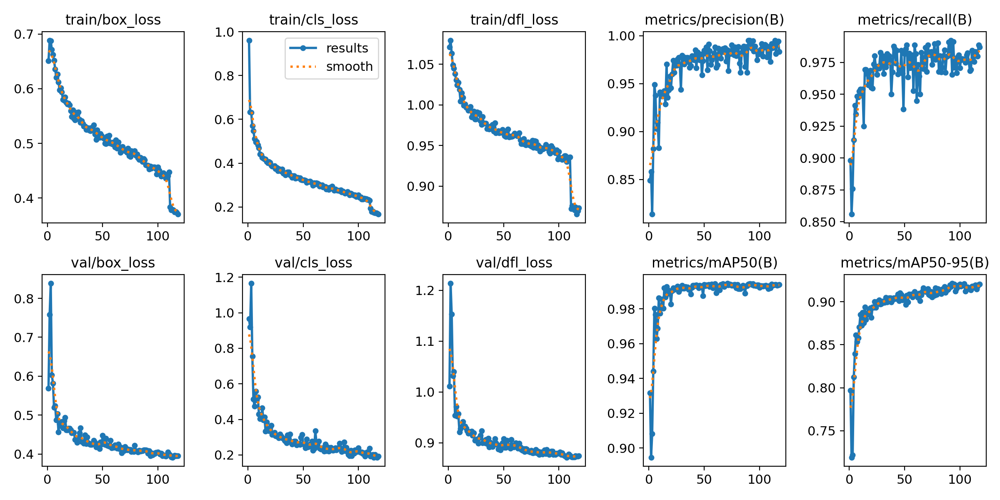

# Huấn luyện và đánh giá mô hình YOLOv8s

Thư mục này trình bày quá trình chuẩn bị dữ liệu, huấn luyện và đánh giá mô hình **YOLOv8s** dùng trong hệ thống phân loại chất lượng quả chanh.

Mô hình thực hiện bài toán **Object Detection** với hai lớp:

- `Good`: chanh tốt
- `Bad`: chanh hỏng

Sau khi huấn luyện, trọng số tốt nhất `best.pt` được sử dụng trong chương trình Python để nhận diện quả chanh từ webcam theo thời gian thực.

---

## 1. Tổng quan

| Thông tin | Chi tiết |
|---|---|
| Bài toán | Object Detection |
| Mô hình | YOLOv8s |
| Framework | Ultralytics |
| Dataset | Roboflow v7 |
| Classes | Good / Bad |
| Tổng số ảnh | 2.524 |
| Tổng số đối tượng | 3.353 |
| Môi trường huấn luyện | Kaggle |
| GPU | NVIDIA Tesla T4 |
| Trọng số tốt nhất | `best.pt` |

---

## 2. Bộ dữ liệu

Bộ dữ liệu gồm hình ảnh quả chanh được gán nhãn bằng **bounding box** và chia thành hai lớp `Good` và `Bad`.

### Thống kê toàn bộ dữ liệu

| Class | Số đối tượng |
|---|---:|
| Good | 1.884 |
| Bad | 1.469 |
| **Tổng cộng** | **3.353** |

### Phân chia dữ liệu

| Dataset | Tỷ lệ | Số ảnh |
|---|---:|---:|
| Train | 80% | 2.030 |
| Validation | 10% | 246 |
| Test | 10% | 248 |
| **Tổng cộng** | **100%** | **2.524** |

Dữ liệu được tiền xử lý trên Roboflow bằng:

- Auto-Orient
- Resize về `640 × 640`
- Không tạo thêm ảnh augmentation cố định trên Roboflow

Các phép augmentation được Ultralytics áp dụng trực tuyến trong quá trình huấn luyện.

---

## 3. Phân bố dữ liệu huấn luyện

Tập Train có tổng cộng **2.723 đối tượng**, gồm:

| Class | Số đối tượng |
|---|---:|
| Good | 1.543 |
| Bad | 1.180 |
| **Tổng cộng** | **2.723** |

Hình dưới thể hiện phân bố lớp, vị trí và kích thước bounding box trong tập huấn luyện.


---

## 4. Cấu hình huấn luyện

Mô hình `yolov8s.pt` đã được pretrained được sử dụng làm trọng số khởi tạo.

Quá trình huấn luyện được thực hiện trên **Kaggle** với GPU **NVIDIA Tesla T4**.

| Tham số | Giá trị |
|---|---|
| Model | `yolov8s.pt` |
| Task | Detection |
| Maximum Epochs | 120 |
| Actual Epochs | 118 |
| Early Stopping | `patience=25` |
| Batch Size | 16 |
| Image Size | `640 × 640` |
| Optimizer | `auto` |
| Seed | 42 |
| Device | NVIDIA Tesla T4 (`device=0`) |
| AMP | `True` |
| Validation | `True` |

Mô hình được đánh giá trên tập Validation sau mỗi epoch.

Giá trị fitness tốt nhất được ghi nhận tại **epoch 93**. Sau 25 epoch tiếp theo không có cải thiện, cơ chế Early Stopping kết thúc quá trình huấn luyện tại epoch 118.

Trọng số tốt nhất được Ultralytics lưu thành:

```text
best.pt
```

---

## 5. Data Augmentation

Ultralytics áp dụng các phép augmentation trực tuyến cho dữ liệu Train trong quá trình huấn luyện.

| Augmentation | Giá trị |
|---|---|
| Hue | `hsv_h=0.015` |
| Saturation | `hsv_s=0.7` |
| Value | `hsv_v=0.4` |
| Translation | `translate=0.1` |
| Scale | `scale=0.5` |
| Horizontal Flip | `fliplr=0.5` |
| Vertical Flip | `flipud=0.0` |
| Mosaic | `mosaic=1.0` |
| Close Mosaic | `close_mosaic=10` |

Mosaic được sử dụng trong phần lớn quá trình huấn luyện và được tắt trong **10 epoch cuối**.

`MixUp` và `CutMix` không được sử dụng.

Các phép augmentation này chỉ áp dụng cho tập Train.

---

## 6. Kết quả huấn luyện

Biểu đồ dưới đây thể hiện quá trình thay đổi của các hàm loss và chỉ số đánh giá trong quá trình huấn luyện YOLOv8s.



Các chỉ số chính bao gồm:

- Box Loss
- Classification Loss
- Distribution Focal Loss
- Precision
- Recall
- mAP@0.5
- mAP@0.5:0.95

Trọng số tốt nhất được ghi nhận tại **epoch 93**.

---

## 7. Kết quả trên tập Validation

Kết quả của mô hình trên tập Validation:

| Metric | Kết quả |
|---|---:|
| Precision | 98,66% |
| Recall | 96,54% |
| mAP@0.5 | 99,39% |
| mAP@0.5:0.95 | 92,15% |

### Precision-Recall Curve


### Confusion Matrix


Kết quả Validation cho thấy mô hình có khả năng nhận diện tốt hai lớp `Good` và `Bad` trên dữ liệu xác thực được sử dụng trong quá trình huấn luyện.

---

## 8. Kết quả trên tập Test Roboflow v7

Sau khi huấn luyện, trọng số tốt nhất `best.pt` được đánh giá trên **248 ảnh Test** của bộ dữ liệu Roboflow v7.

| Metric | Kết quả |
|---|---:|
| Precision | 98,53% |
| Recall | 96,88% |
| mAP@0.5 | 98,67% |
| mAP@0.5:0.95 | 90,80% |

AP@0.5 theo từng lớp:

| Class | AP@0.5 |
|---|---:|
| Bad | 98,4% |
| Good | 98,9% |

> **Lưu ý:** Bộ dữ liệu Roboflow v7 được phân chia theo ảnh. Một số ảnh chụp ở các góc khác nhau của cùng một quả chanh có thể xuất hiện ở cả tập Train và Test. Vì vậy, kết quả trên tập Test v7 được sử dụng như kết quả tham khảo và không được chọn làm kết quả chính để đánh giá khả năng tổng quát hóa của mô hình.

---

## 9. Kiểm thử trên bộ dữ liệu độc lập

Để đánh giá khả năng tổng quát hóa trên dữ liệu chưa được sử dụng trong quá trình huấn luyện, mô hình được kiểm tra thêm trên một bộ dữ liệu độc lập.

Bộ dữ liệu độc lập được thu thập trong một đợt riêng và không được sử dụng để:

- Huấn luyện mô hình
- Lựa chọn epoch
- Điều chỉnh mô hình

Phiên bản dữ liệu độc lập gồm:

| Thông tin | Giá trị |
|---|---:|
| Tổng số ảnh | 246 |
| Test | 243 |
| Validation | 3 |
| Train | 0 |
| Tổng số đối tượng | 268 |

Kết quả đánh giá chính được tính trên **243 ảnh Test chứa 265 đối tượng**:

| Class | Số đối tượng |
|---|---:|
| Bad | 220 |
| Good | 45 |
| **Tổng cộng** | **265** |

### Kết quả đánh giá

| Metric | Kết quả |
|---|---:|
| Precision | **95,32%** |
| Recall | **92,90%** |
| mAP@0.5 | **95,76%** |
| mAP@0.5:0.95 | **82,12%** |

AP@0.5 theo từng lớp:

| Class | AP@0.5 |
|---|---:|
| Bad | 93,2% |
| Good | 98,4% |

### Precision-Recall Curve


### Confusion Matrix


Kết quả trên bộ dữ liệu độc lập được sử dụng làm **kết quả chính** để đánh giá khả năng tổng quát hóa của mô hình.

---

## 10. So sánh kết quả đánh giá

| Dataset | Precision | Recall | mAP@0.5 | mAP@0.5:0.95 |
|---|---:|---:|---:|---:|
| Validation | 98,66% | 96,54% | 99,39% | 92,15% |
| Roboflow v7 Test | 98,53% | 96,88% | 98,67% | 90,80% |
| **Independent Test** | **95,32%** | **92,90%** | **95,76%** | **82,12%** |

Kết quả trên bộ dữ liệu độc lập thấp hơn so với Validation và Test v7 nhưng phản ánh thực tế hơn khả năng tổng quát hóa của mô hình trên dữ liệu chưa được sử dụng trong quá trình phát triển mô hình.

---

## 11. Cấu hình đánh giá

Các lần đánh giá ngoại tuyến sử dụng trọng số tốt nhất `best.pt`.

| Tham số | Giá trị |
|---|---|
| Weights | `best.pt` |
| Method | `model.val()` |
| Split | `test` |
| Image Size | `640 × 640` |
| Batch Size | 16 |
| Device | NVIDIA Tesla T4 |
| Plots | `True` |
| Ultralytics | 8.4.132 |

Ví dụ lệnh đánh giá:

```python
results = model.val(
    data=DATA_YAML,
    split="test",
    imgsz=640,
    batch=16,
    device=0,
    plots=True
)
```

---

## 12. Triển khai mô hình

Cấu hình huấn luyện và đánh giá ngoại tuyến sử dụng:

```text
imgsz=640
```

Khi triển khai mô hình nhận diện theo thời gian thực từ webcam, hệ thống sử dụng:

```text
imgsz=320
confidence=0.60
```

Kích thước ảnh nhỏ hơn được sử dụng nhằm giảm khối lượng tính toán và duy trì tốc độ xử lý gần thời gian thực.

Trong quá trình thử nghiệm, tốc độ hiển thị đạt khoảng:

```text
30.2 - 31.4 FPS
```

---

## 13. Luồng hoạt động

```text
Lemon Dataset
      │
      ▼
Data Annotation
      │
      ▼
Train / Validation / Test
      │
      ▼
YOLOv8s Pretrained Model
      │
      ▼
Model Training
      │
      ▼
Validation
      │
      ▼
best.pt
      │
      ▼
Independent Test
      │
      ▼
Model Evaluation
      │
      ▼
Real-time Deployment
```

Khi triển khai trong hệ thống:

```text
USB Webcam
     │
     ▼
OpenCV
     │
     ▼
YOLOv8s (best.pt)
     │
     ▼
Good / Bad Detection
     │
     ▼
Sorting Logic
     │
     ▼
UART
     │
     ▼
STM32F103C6T6
     │
     ▼
Servo Sorting Mechanism
```

Máy tính đảm nhiệm xử lý ảnh và chạy YOLOv8s. STM32F103C6T6 nhận kết quả phân loại thông qua UART và điều khiển cơ cấu gạt sản phẩm.

---

## 14. Kết luận

Mô hình YOLOv8s được huấn luyện trên bộ dữ liệu gồm **2.524 ảnh và 3.353 đối tượng** thuộc hai lớp `Good` và `Bad`.

Kết quả chính trên bộ dữ liệu kiểm thử độc lập gồm 243 ảnh đạt:

- **Precision: 95,32%**
- **Recall: 92,90%**
- **mAP@0.5: 95,76%**
- **mAP@0.5:0.95: 82,12%**

Sau khi đánh giá, trọng số tốt nhất `best.pt` được sử dụng trong chương trình Python để nhận diện quả chanh theo thời gian thực và truyền kết quả phân loại đến STM32F103C6T6 thông qua UART.

---

## Cấu trúc thư mục

```text
training/
├── README.md
└── images/
    ├── dataset_distribution.png
    ├── results.png
    ├── pr_curve_validation.png
    ├── confusion_matrix_validation.png
    ├── pr_curve_independent.png
    └── confusion_matrix_independent.png
```
